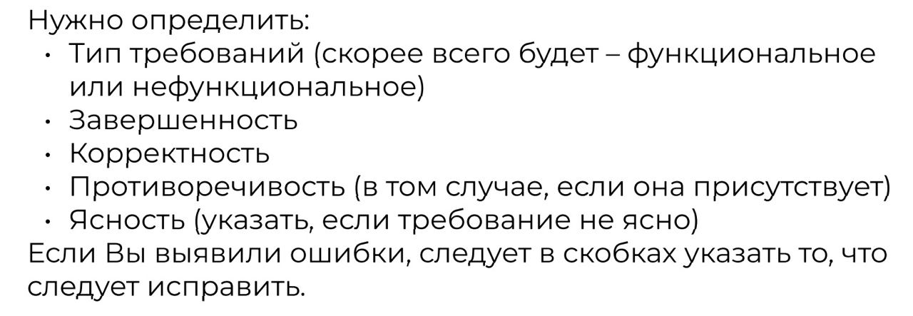

## Условие. 

**Общее:** интернет магазин. 
Есть категории товаров, корзина покупок, поиск, личный кабинет.
1. После входа в личный кабинет открывается главная страница сайта.
1. Поисковая строка ищет по ID товара и названию.
1. В корзину можно добавить товар.
1. Можно создать и сохранить список покупок.
1. Можно выбрать способ оплаты.

*Определить:*

### Решение.

