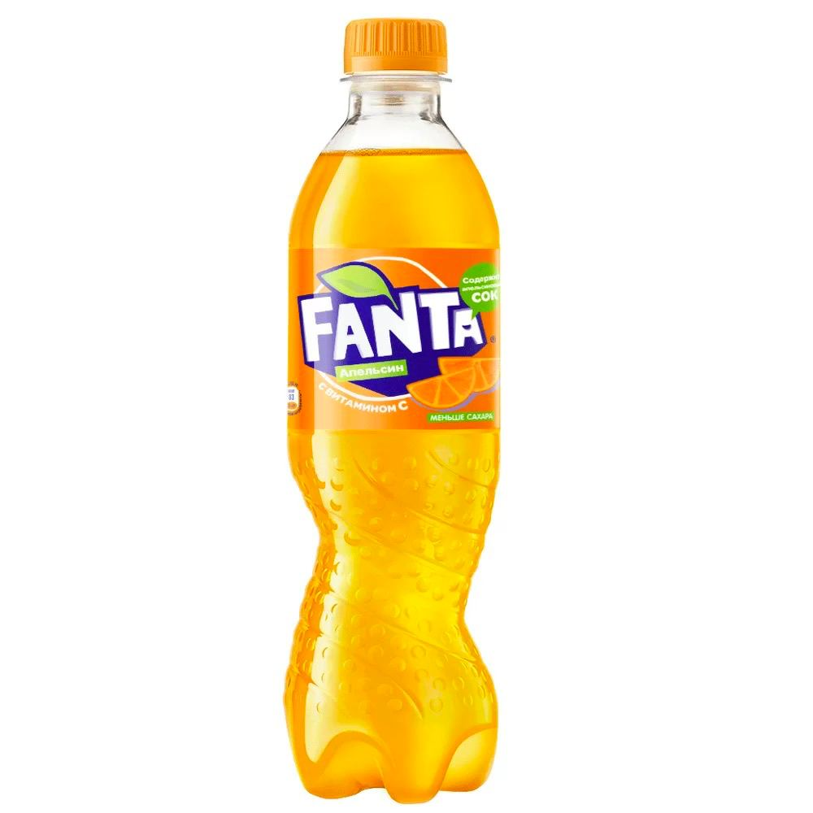

## Условие.

- расписать по таблице виды и уровни тестирования.
- ОБЯЗАТЕЛЬНО! все виды не функционального тестирования из тех, что есть в презентации.

### Решение.

1. По запуску кода на исполнение.
    - Статическое: Состав материала, из которого изготовлена бутылка, крышка и жидкость, изучение документации о том, как должна была быть изготовлена бутылка, крышка и жидкость (технология, материалы и т.д.), визуальное соответствие фактического вида бутылки, крышки и жидкости к заявленному.
    - Динамическое: Лежит ли бутылка в руке, имеет/ не имеет физических деффектов бутылка (протекает), крышка (не закрывается, не открывается), жидкость (ведёт себя, как водянистая субстанция), открывается ли крышка, выливается ли жидость из горлышка.
1. По доступу к коду и архитектуре приложения.
    - Белый ящик: Состав материала, из которого изготовлена бутылка, крышка и жидкость.
    - Чёрный ящик: Лежит ли бутылка в руке, имеет/ не имеет физических деффектов бутылка (протекает), крышка (не закрывается, не открывается), жидкость (ведёт себя, как водянистая субстанция), открывается ли крышка, выливается ли жидость из горлышка.
    - Серый ящик: Объединение информации из пунктов "Белый ящик" и "Чёрный ящик".
1. По степени автоматизации.
    - Ручное: Проводим тесты самостоятельно, руками.
    - Автоматизированние: Проводим тест при помощи робототизированной руки-контроллера.
1. По уровню детализации приложения.
    - Модульное: Соответствие фактического дизайна бутылки и крышки по сравнению с заявленным. Проверка материалов, из которых была изготовлена бутылка и крышка. Соответствует ли крышка, бутылка и жидкость заявленому в спецификации (состав).
    - Интеграционное: Соответствует ли бутылка и крышка указанному дизану, имеет ли жидкость заявленный цвет. Правильно ли собраны компоненты бутылки (жидкость внутри бутылки, крышка закрывает бутылку).
    - Системное: Откручивается ли крышка бутылки, выливается ли жидкость. Деформируется ли бутылка, крышка и жидкость при стандартных температурных условиях (комнатная температура), всегда ли крышка открывается/закрывается, всегда ли жидкость выливается.
1. По степени важности тестируемых функции.
    - Дымовое: Имеет ли бутылка физическую целостность (не протекает). Имеется ли крышка, находится ли в бутылке заявленная жидкость в полном объёме.
    - Критического пути: Возмодно ли держать бутылку в руках, возможно ли открыть\закрыть крышку, возможно ли вылить/ залить жиидкость в\их бутылки.
    - Расширенное:  изменяется ли физически бутылка и крышка при использовани их в чрезмерно холодных/ жарких помещениях, возможно ли залить в бутылку любую жидкость повторно, держится ли пустая закрытая бутылка на воде, выделяет ли бутылка едкие вещ-ва при воздействии огня.
1. По принципу работы с приложением:
    - Позитивное:
    - Негативное: